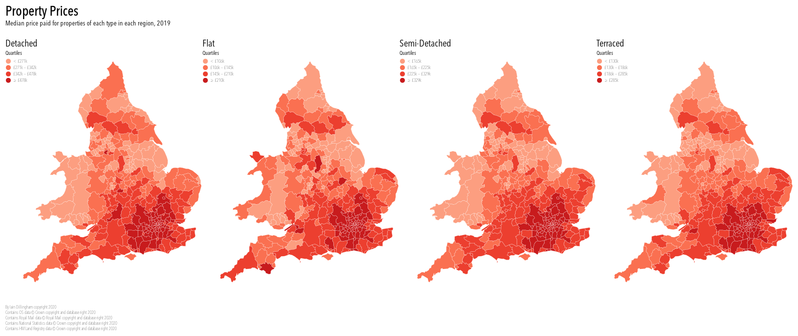

# Property Prices

A map of property prices.



## Datasets

This project uses the following datasets:

* Ordnance Survey [Boundary-Line][]
* Ordnance Survey [Code-Point Open][]
* HM Land Registry [Price Paid Data][]

These datasets are released under the [Open Government Licence][].
The following attribution statements apply:

* Contains OS data © Crown copyright and database right 2020
* Contains Royal Mail data © Royal Mail copyright and database right 2020
* Contains National Statistics data © Crown copyright and database right 2020
* Contains HM Land Registry data © Crown copyright and database right 2020

## Directory structure

This project uses the Cookiecutter Data Science [directory structure][1].

```
.
├── bin              <- QA scripts
├── data             <- Data processing stages
│   ├── external     <- Stage 1, data that are external to this project
│   ├── interim      <- Stage 3
│   ├── processed    <- Stage 4
│   └── raw          <- Stage 2
├── models           <- Data for visualization
├── reports          <- Analysis
│   └── figures      <- Figures for analysis
├── specs            <- Vega specifications for visualization
├── src              <- Python source code
│   └── data         <- Data processing scripts
└── tests            <- Tests for Python source code
```

(Run `tree -d -L 2 -I __*__` to create the above.)

## Setup

First, install [Poetry][], [topojson-server][], [topojson-simplify][], and [vega-cli][].
Then, run:

```sh
poetry install & poetry run dvc pull
```

## Motivations

* **To make a map with [Vega][].**
  How much control does Vega give over, for example, titles, legends, and labels?
  To what extent is [command-line cartography][] possible without using D3.js directly?
  How easy is it to switch between in-browser rendering, using the [Vega Editor][], and offline rendering, using `vg2svg`?

* **To use Vega with projected spatial data.**
  The Ordnance Survey datasets contain eastings and northings using the British National Grid, rather than longitude and latitude using WGS84.
  How to configure a Vega projection with projected spatial data?

* **To use the Cookiecutter Data Science directory structure for a project that doesn't involve modelling.**
  To what extent is the `data/<stage>/<dataset>` directory structure effective?

* **To use the Cookiecutter Data Science directory structure with Poetry.**
  When a project isn't a library, it's convenient to keep Python source code in the `src` directory.
  However, Poetry has to be tricked into initializing this directory structure:
  Name the package `src` and rename the parent directory, after running `poetry new src`.
  Are there any pitfalls?

* **To learn more about [DVC][].**
  What are the strengths and limitations of [data pipelines][], for example?

## Licence

This project, but not its datasets (see above), is released under the MIT Licence.

[1]: https://drivendata.github.io/cookiecutter-data-science/#directory-structure
[Boundary-Line]: https://www.ordnancesurvey.co.uk/business-government/products/boundaryline
[Code-Point Open]: https://www.ordnancesurvey.co.uk/business-government/products/code-point-open
[command-line cartography]: https://medium.com/@mbostock/command-line-cartography-part-1-897aa8f8ca2c
[data pipelines]: https://dvc.org/doc/start/data-pipelines
[DVC]: https://dvc.org/
[Open Government Licence]: http://www.nationalarchives.gov.uk/doc/open-government-licence/version/3/
[Poetry]: https://python-poetry.org/
[Price Paid Data]: https://www.gov.uk/government/collections/price-paid-data
[topojson-server]: https://www.npmjs.com/package/topojson-server
[topojson-simplify]: https://www.npmjs.com/package/topojson-simplify
[Vega Editor]: https://vega.github.io/editor/#/custom/vega
[vega-cli]: https://www.npmjs.com/package/vega-cli
[Vega]: https://vega.github.io/vega/
